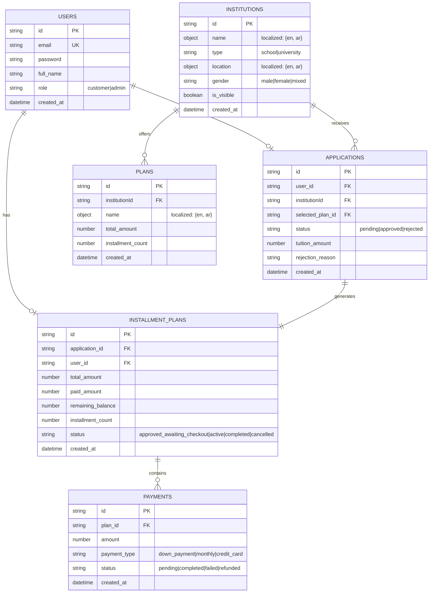
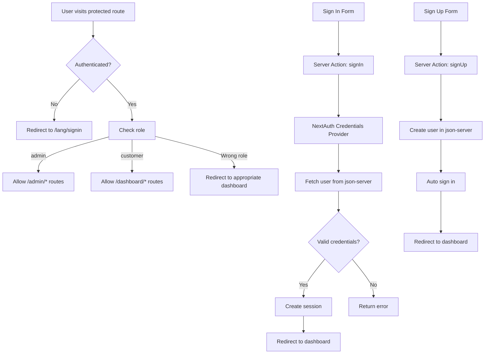
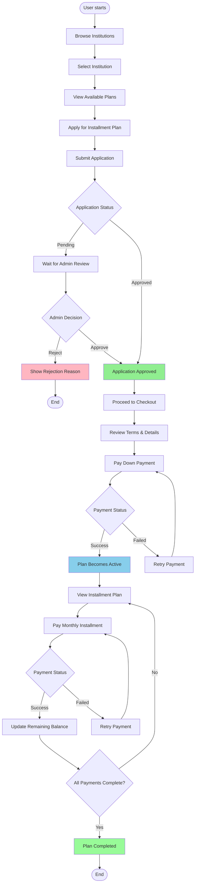

# Buy Now, Pay Later - Education Financing App

A modern web application that simulates a Buy Now, Pay Later (BNPL) service for education payments, built with Next.js and TypeScript.

## 📋 Project Overview

This application enables two main user roles:

- **End User (Customer/Parent/Student)** - Browse schools/universities, apply for installment plans, make payments, and manage their education financing
- **Admin** - Manage institutions, review applications, and oversee installment plans

## 🛠 Tech Stack

### Frontend

- **Framework**: Next.js 16.1.1 (App Router)
- **Language**: TypeScript 5
- **Styling**: Tailwind CSS 4
- **UI Components**: shadcn/ui (Radix UI primitives)
- **State Management**: TanStack Query (React Query) for server state
- **Authentication**: NextAuth.js 4.24.13
- **Animations**: Framer Motion (planned)
- **Internationalization**: Next.js i18n routing with `@formatjs/intl-localematcher`

### Backend

- **Mock API**: json-server 1.0.0-beta.3
- **API Routes**: Next.js API routes for server actions

### Deployment

- **Platform**: Cloudflare Pages (planned)

## 🏗 Architecture Decisions

### 1. Backend Strategy

- **json-server** is used as a mock backend to simplify development and focus on frontend architecture
- All API calls go through Next.js API routes which proxy to json-server
- This allows for easy migration to a real backend later

### 2. Static Generation & Caching

- Institution listing pages are statically generated at build time
- Individual institution pages use ISR (Incremental Static Regeneration)
- Cache strategy: `cache: "max"` ensures old data remains available while new data is fetched
- Revalidation occurs on CRUD operations (create, update, delete)
- This provides excellent performance and SEO benefits

### 3. Localization

- Multi-language support (English/Arabic) using Next.js i18n routing
- Institution data stored with localized fields (name, location)
- Language detection via `negotiator` package

### 4. Authentication Flow

- NextAuth.js handles session management
- Credentials provider authenticates against json-server
- Role-based access control (customer/admin)
- Protected routes with middleware
- See [Authentication Flow Diagram](#authentication-flow) below

### 5. Development Phases

1. **Phase 1**: Core functionality (authentication, CRUD operations, business logic)
2. **Phase 2**: Animations with Framer Motion
3. **Phase 3**: Deployment to Cloudflare

## 📊 Database Schema

The application uses json-server with the following data structure  ( [ER diagram available here](docs/db-schema.svg) ):



## 🔐 Authentication Flow

The authentication system uses NextAuth.js with the following flow  ( [flow diagram available here](docs/auth-diagram.svg) )  :



## 💼 Business Flow

The application follows this business logic flow ( [flow diagram available here](docs/db-schema.svg) ):



## 🚀 Setup Instructions

### Prerequisites

- Node.js 20+
- npm/pnpm/yarn

### Installation

1. **Clone the repository**

   ```bash
   git clone <repository-url>
   cd buy-now-pay-later
   ```

2. **Install dependencies**

   ```bash
   npm install
   # or
   pnpm install
   ```

3. **Set up environment variables**
   Create a `.env.local` file:

   ```env
   NEXTAUTH_SECRET=your-secret-key-here
   NEXT_PUBLIC_API_URL=LOCAL_SERVER_URL
   NEXT_PUBLIC_API_JSON_SERVER=JSON_SERVER_URL

   ```

4. **Start json-server** (in a separate terminal)

   ```bash
   npx json-server --watch db.json --port 3001
   ```

5. **Run the development server**

   ```bash
   npm run dev
   # or
   pnpm dev
   ```

6. **Open your browser**
   Navigate to your local server URL, default to: [http://localhost:3000](http://localhost:3000)

### Development Scripts

- `npm run dev` - Start development server
- `npm run build` - Build for production
- `npm run start` - Start production server

## 📝 Assumptions & Tradeoffs

### Assumptions

1. **Backend Simplification**
   - Using json-server assumes this is primarily a frontend demonstration project
   - Real authentication and payment processing would require proper backend infrastructure

2. **Localization**
   - Currently supports English and Arabic
   - Assumes all user-facing content will be translated
   - Institution data includes localized fields

3. **Payment Processing**
   - Payment flow is simulated (no real payment gateway integration)
   - Payment statuses are manually updated for demonstration purposes

4. **User Roles**
   - Two distinct roles: `customer` and `admin`
   - Admin users can manage all aspects of the system
   - Customer users can only manage their own data

### Tradeoffs

1. **json-server vs Real Backend**
   - **Pros**: Fast development, easy setup, focus on frontend
   - **Cons**: Limited scalability, no real authentication, no production-ready features
   - **Mitigation**: API routes abstract backend calls, making migration easier

2. **Static Generation vs SSR**
   - **Pros**: Better performance, SEO, reduced server load
   - **Cons**: Requires revalidation on updates, initial build time
   - **Mitigation**: Using ISR with `cache: "max"` ensures fresh data while maintaining performance

3. **NextAuth vs Custom Auth**
   - **Pros**: Battle-tested, secure, easy to implement
   - **Cons**: Additional dependency, learning curve
   - **Mitigation**: Standard solution reduces security risks

4. **Cloudflare vs Vercel**
   - **Pros**: Global CDN, competitive pricing, good performance
   - **Cons**: May require additional configuration for Next.js features
   - **Mitigation**: Cloudflare Pages supports Next.js well

## 🗺 Project Structure

```
buy-now-pay-later/
├── src/
│   ├── app/                    # Next.js App Router pages
│   │   ├── (auth)/            # Authentication routes
│   │   ├── (customer)/        # Customer routes
│   │   ├── admin/             # Admin routes
│   │   └── api/               # API routes
│   ├── components/            # React components
│   │   ├── ui/                # shadcn/ui components
│   │   └── layout/            # Layout components
│   ├── lib/                   # Utility functions
│   ├── types/                 # TypeScript types
│   └── providers/             # Context providers
├── db.json                    # json-server database
├── docs/                      # Documentation
│   └── auth-diagram.svg      # Authentication flow diagram
└── README.md                  # This file
```

## 🔄 Caching Strategy

### Static Pages

- Institution listing: Generated at build time, revalidated on-demand
- Individual institution pages: ISR with 24-hour revalidation

### Cache Configuration

```typescript
// Example cache configuration
fetch(url, {
  cache: 'force-cache', // Use cached data
  next: {
    revalidate: 3600, // Revalidate every hour
    tags: ['institutions'] // Cache tags for revalidation
  }
})
```

### Revalidation Triggers

- Create/Update/Delete operations trigger cache revalidation
- Uses Next.js `revalidateTag()` or `revalidatePath()` APIs
- Old data remains available until new data is ready (stale-while-revalidate pattern)

## 🎨 UI/UX Features

- Responsive design (mobile-first)
- Dark mode support (via next-themes)
- Accessible components (Radix UI)
- Loading states and error handling
- Form validation
- Toast notifications (planned)

## 🧪 Testing (Future)

- Unit tests for utility functions
- Component tests for UI components
- E2E tests for critical user flows
- Testing framework: Jest + React Testing Library (planned)

## 📦 Deployment

### Cloudflare Pages Setup

1. **Build Configuration**
   - Build command: `npm run build`
   - Output directory: `.next`

2. **Environment Variables**
   - Set `NEXTAUTH_SECRET` in Cloudflare dashboard
   - Set `NEXTAUTH_URL` to production domain
   - Set `NEXT_PUBLIC_API_URL` to json-server URL (or real API)

3. **Deployment**
   - Connect GitHub repository
   - Configure build settings
   - Deploy automatically on push to main branch

## 📚 Additional Resources

- [Next.js Documentation](https://nextjs.org/docs)
- [NextAuth.js Documentation](https://next-auth.js.org/)
- [shadcn/ui Components](https://ui.shadcn.com/)
- [Tailwind CSS Documentation](https://tailwindcss.com/docs)
- [json-server Documentation](https://github.com/typicode/json-server)

## 👥 Contributing

This is a demonstration project. For production use, consider:

- Real backend API
- Payment gateway integration
- Comprehensive testing
- Security audit
- Performance optimization
- Accessibility audit

## 📄 License

[Your License Here]

---

**Note**: This project is built for demonstration purposes. For production deployment, additional security measures, testing, and infrastructure considerations are required.
